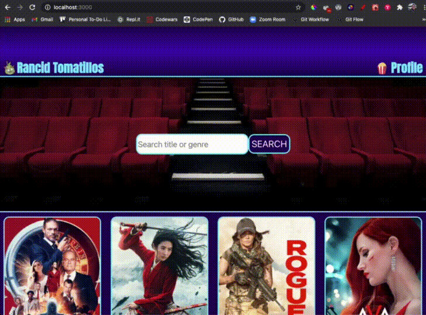
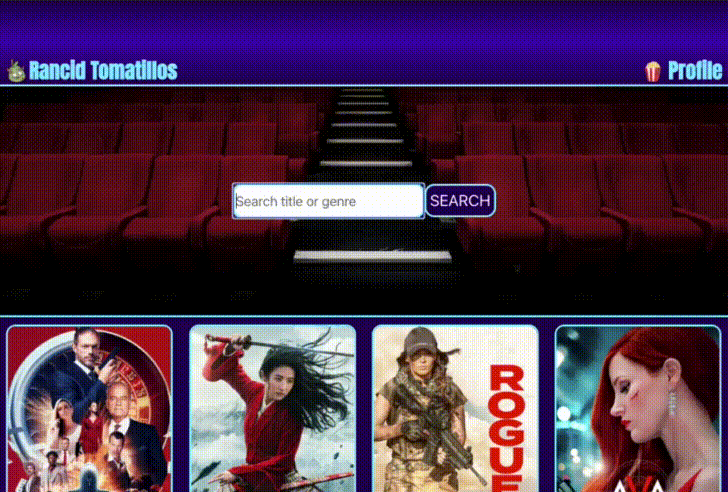

# Rancid Tomatillos

## Table of Contents
* [Description](#description)
* [Installation](#installation)
* [Walkthrough](#walkthrough)
* [New Learning](#newlearning)
* [Authors](#authors)
* [Technologies](#technologies)

## Description

 - This project was a paired project assigned by [Turing School of Software and Design](www.turing.edu).  We were given two weeks to complete a mock movie review website based on movies that were pulled from an existing API using React.  We were continually learning how to use React, Router and Cypress throughout the scope of the project.  We were given full creative control of the design of the project.   

### Notable features

 - Built using React framework
 - Use of Router to enable user to navigate using back and forward browser controls.
 - Tested with Cypress acceptance testing including the use of stubbed fetch data and happy/sad paths
 - Utilized responsive design for mobile, tablet or desktop viewing
 - Applied a search feature that filters movies based on their title
 - Utilized a modular file structure for easy file navigation

### Deploy Link

http://errm-rancid-tomatillos.surge.sh/

## Installation
1. Clone down this [repo](https://github.com/errabun/Rancid-Tomatillos)
2. CD into project directory
3. Run npm i to install all project dependencies
4. Run npm start to begin the server
5. Application should be shown in separate window once npm start is complete

## Walkthrough

 - When you arrive on the homepage of the app, a fetch request will get and display each of the movie posters.  The user will be able to select a movie by clicking on the poster to review its details such as the budget, revenue, brief description, tagline, etc. After reviewing the movie information, the user will have an option to 'Return home' to be redirected back to the homepage, or the user can use the back arrow that is built into their browser to navigate back to the homepage. The user will also be able to search for a movie by its full title or partial title by making use of the search functionality at the top of the landing page.  

Desktop

Tablet

Mobile

MovieInfo - When a card is clicked, the information for that specific movie is displayed with the ability to navigate back to the homepage

Router Ability - URL and current MovieInfo displaying are updated together

Search Ability

## New Learning

- React fundamentals
- Router
- Cypress Acceptance Testing

### Learning Goals

Our learning goals for the project were to gain competency with React fundamentals, to learn how to test React components & asynchronous JS, to practice refactoring, and to create a multi-page UX using Router.

### Project Progression

We began this project after one lesson on React using some mock data to get a few movies to display in our App component.  We continually were introduced to several new features that we were able to implement throughout the project including the use of Router, Cypress acceptance testing, asynchronous JavaScript, and the use of conditional rendering.  Seeing as we were just learning so many of the features we implemented, we took a few days to do extra research into each of the topics before we added them into the project.  In order to solidify our understanding of new topics, we utilized a driver/navigator coding approach that was very helpful for both of us.

### Reflections

 - Eric: There were so many wins throughout the course of this project that really helped my understanding of the use of functional and class components in React, re-routing the user and being able to display information based on the url so the user can utilize the back/forward arrow commands in their browser, and Cypress testing.  Riley is incredibly knowledgable, compassionate and organized so the flow of the project was seamless from start to end.  Happy with the way our project is designed and functions!

 - Riley: Because we took the time to read up on React, Router, and Cypress before using them in our project, the implementation of each of these new technologies went really smoothly. It was great to take our time with the learning and gain so much from it. It was my first time with acceptance testing and it was fun to shift my thinking about testing to gain a better awareness of the user experience. Eric is very patient, positive, and motivated, making for a really wonderful project and learning experience.

## Authors
<table>
    <tr>
        <td> Eric Rabun <a href="https://github.com/errabun">GH</td>
        <td> Riley Martin <a href="https://github.com/RMartin0717">GH</td>
    </tr>
    </tr>
        <td></td>
        <td></td>
    </tr>
</table>

## Technologies
<table>
    <tr>
        <td>Framework</td>
        <td>Functionality</td>
        <td>Structure</td>
        <td>Styling</td>
    </tr>
    </tr>
        <td></td>
        <td></td>
        <td></td>
        <td></td>
    </tr>
</table>
